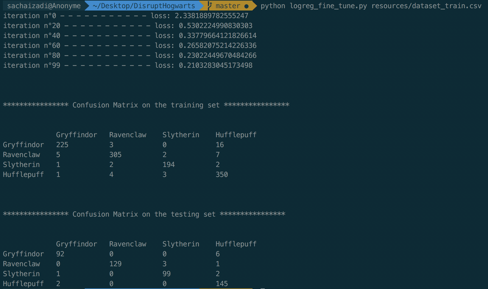
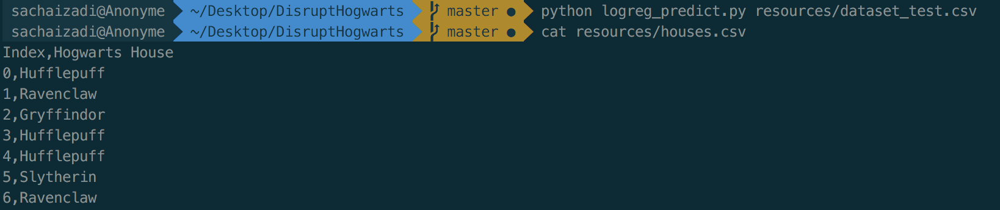

# Disrupt Hogwarts

Disrupt Hogwarts is a project done during the 2-week stay at Ecole 42. The aim was to build a machine-learning-powered Harry Potter's Sorting Hat (*Choipeaux magique* in French) that could tell which Hogwarts House you belong to based on given features.

More prosaically, the project consisted in implementing from scratch (no scikit-learn) a Logistic Regression model.

## Clone the repo
Run `git clone https://github.com/SachaIZADI/DisruptHogwarts.git`in your shell.

Then ```mkvirtualenv --python=`which python3` hogwarts``` (You can escape the virtualenv by running `deactivate`)

Then finally run `pip3 install requirements.txt`. And You're up to play with the project.


## Run the scripts

**/!\ Make sure to use python3 and not python2 /!\ .**

### Statistics and exploratory analysis
Input: Run `python3 describe.py resources/dataset_train.csv` in your terminal

Output: 


### DataViz
#### Histograms
Input: Run `python3 histogram.py` in your terminal

Output: 


#### Scatter plot
Input: Run `python3 scatter_plot.py` in your terminal

Output: 


#### Pair plot
Input: Run `python3 pair_plot.py` in your terminal

Output: 


### Logistic regression

#### A bit of theory
The maths behind logistic regression rely on the modelling of the probability $\mathbb{P}(Y=yi|X=x_i)$ as an expit function of $x_i$ :


To estimate the parameters $\beta_j$, we maximize the log-likelihood of the model, or equivalently we minimize the opposite of the log-likelihood (=the loss function).


To do so, we use the gradient descent algorithm that updates the values of the $\beta_j$ by going the opposite way of the gradient: 


#### Fine-tuning the model and making experiments
Use the following script to split the model into a training and a testing set (by default 70%-30%), train a logistic regression and compute the confusion matrix. Think of this script as a lab to run experiments.

Input: Run `python3 logreg_fine_tune.py resources/dataset_train.csv`

Output: *NB: true labels are on the 1st row & predicted labels are on the 1st column.*



#### Training the model on the full dataset
Input: Run `python3 logreg_train.py resources/dataset_train.csv`

Output:


#### Making predictions
Input: Run `python3 logreg_predict.py resources/dataset_test.csv`

Output:




#### Try other optimizer: eg. Stochastic Gradient Descent
Input: Run `python3 logreg_fine_tune_sgd.py resources/dataset_train.csv`

Output:


