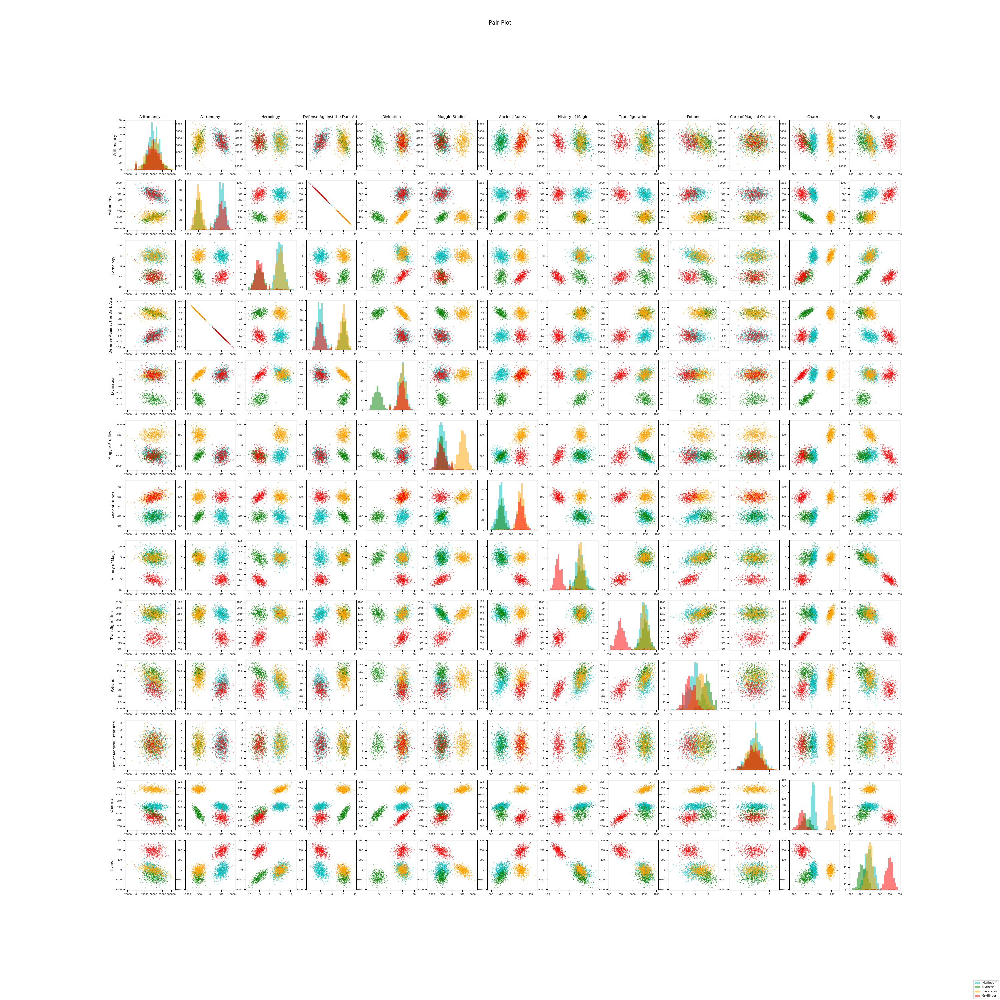

# Disrupt Hogwarts

## Clone the repo
Run `git clone https://github.com/SachaIZADI/DisruptHogwarts.git`in your shell.

Then ```mkvirtualenv --python=`which python3` hogwarts``` (You can escape the virtualenv by running `deactivate`)

Then finally run `pip3 install requirements.txt`. And You're up to play with the project.


## Run the scripts

**/!\ Make sure to use python3 and not python2 /!\ .**

### Statistics and exploratory analysis
Input: Run `python3 describe.py resources/dataset_train.csv` in your terminal

Output: 


### DataViz
#### Histograms
Input: Run `python3 histogram.py` in your terminal

Output: 


#### Scatter plot
Input: Run `python3 scatter_plot.py` in your terminal

Output: 


#### Pair plot
Input: Run `python3 pair_plot.py` in your terminal

Output: 




### Logistic regression

Formulas:


