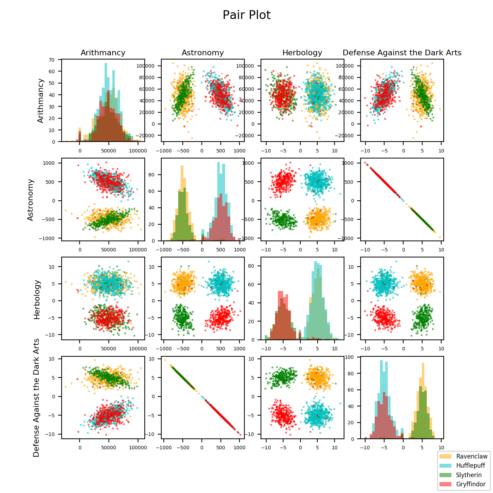

# Disrupt Hogwarts

## Statistics and exploratory analysis
Input: Run `python3 describe.py resources/dataset_train.csv` in your terminal

Output: 

## DataViz
### Histograms
Input: Run `python3 histogram.py` in your terminal

Output: 

### Scatter plot
Input: Run `python3 scatter_plot.py` in your terminal

Output: 

### Pair plot
Input: Run `python3 pair_plot.py` in your terminal

Output: 

